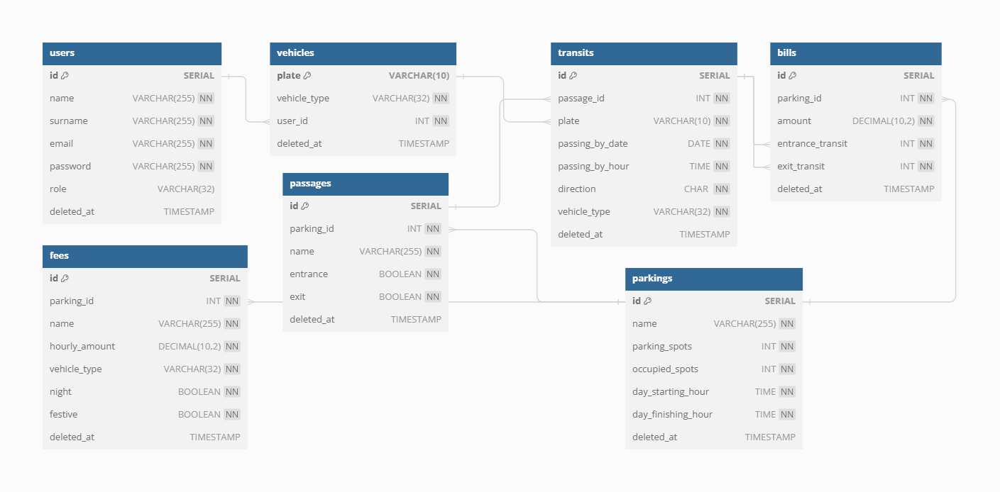
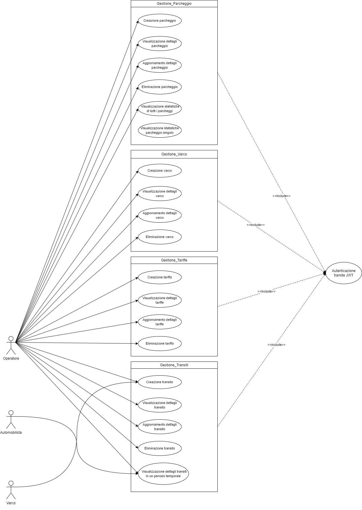
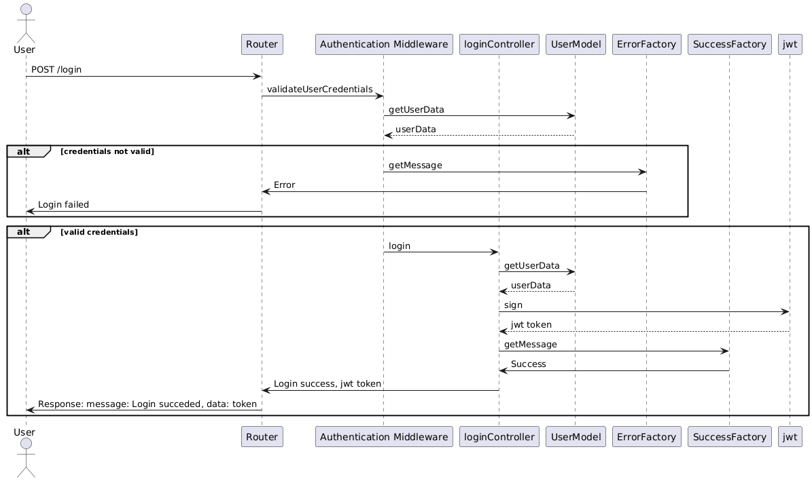
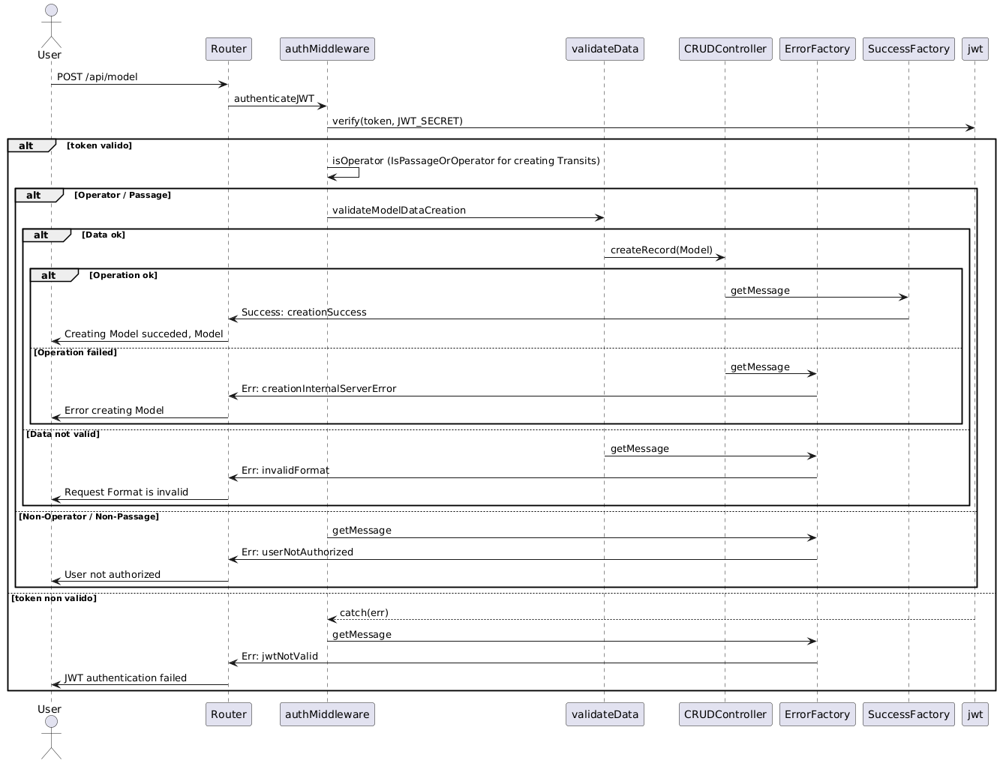
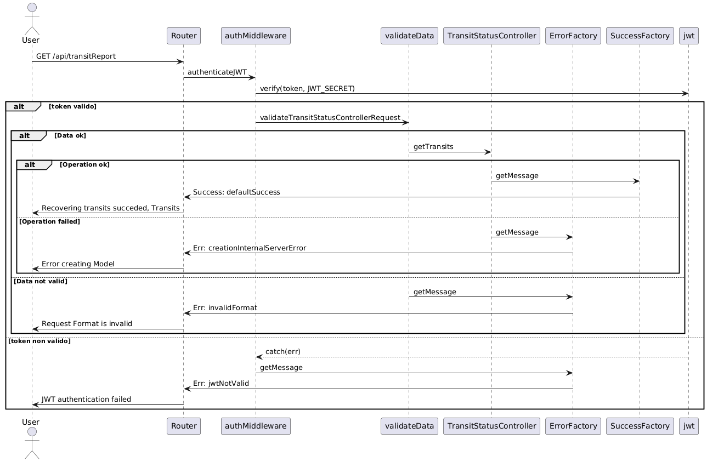
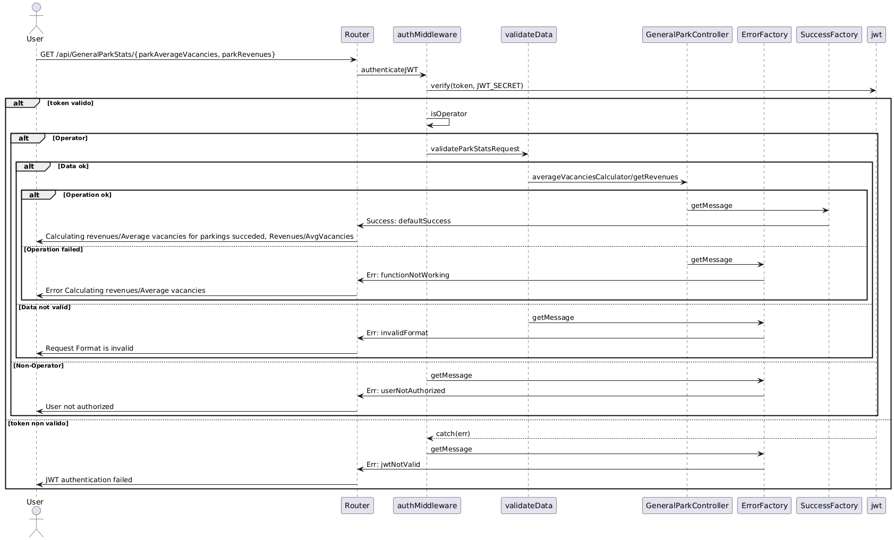
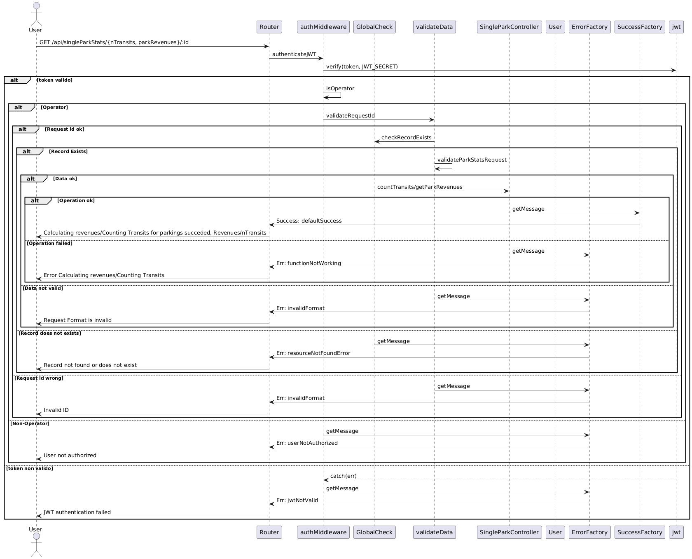

<p align="center">
  
</p>


<div align="center">
 
[](https://www.postgresql.org/)
[](https://www.npmjs.com/)
[](https://nodejs.org/en)
[](https://expressjs.com/it/)
[](https://jwt.io/)
[](https://code.visualstudio.com/)
[](https://www.typescriptlang.org/)
[](https://sequelize.org/)
[](https://www.docker.com/)
[](https://www.postman.com/)
 
</div>

# Progetto-PA-2024: Backend per un sistema di gestione del calcolo del costo dei parcheggi
<p align="right">
  
</p>

## Specifica e obiettivi del progetto
Si realizzi un sistema che consenta di gestire il calcolo del costo dei parcheggi a seguito del passaggio di autoveicoli con classi differenti tra un varco di ingresso e di uscita. Un parcheggio può avere diversi punti di ingresso e diversi punti di uscita. Dovranno essere modellati le tipologie di veicolo che hanno poi costi differenti. Dovranno essere inseribili i transiti impostando data e ora del passaggio e targa del veicolo lungo un varco specifico di un dato parcheggio; la richiesta di inserimento deve essere rifiutata se non ci sono più posti disponibili all’interno del parcheggio. Un veicolo in un giorno può parcheggiare in diversi parcheggi. Il sistema deve anche provvedere a calcolare il costo del parcheggio in funzione della permanenza effettiva all’interno dello stesso.

La specifica completa è consultabile nel seguente [documento](Programmazione_avanzata_richieste.pdf)

## Installazione

### Requisiti 

Per installare l'applicazione è necessario avere installato l'ultima versione di Docker-compose, seguendo le istruzioni in base al tipo di architettura su cui gira la propria macchina. Inoltre è necessario avere installato Git, in modo tale da riuscire a clonare correttamente il codice.  

Per il testing dell'applicazione viene utilizzato il client API Postman. La collection a cui si fa riferimento, dove viene testato il funzionamento del codice sia in caso di successo che in caso di fallimento, è accessibile tramite questo [file](Progetto_PA_Postman_collection.json), da scaricare, oppure tramite questo [link](https://app.getpostman.com/join-team?invite_code=4858424712b7a1c26f59cbd9d6099db9&target_code=0562f44015402f8eafa438a4bb2504d8).

### Avvio del progetto

1. Clonare la repository con il comando:
    ```
    git clone https://github.com/marcoincipini/Progetto-PA-2024.git
    ```

2.  Avviare il docker-compose costituito dal container dell'applicazione e dal container Postgres. Questo comando permette di buildare il codice e di far partire automaticamente il server
    ```
    docker-compose up --build 
    ```

3. Aprire postman e caricare la seguente collection

4.  (Se necessario) Dato che il codice va a creare un database Postgres tramite un file di seeding, se fosse necessario eliminare tutti i cambiamenti fatti al database sarebbe necessario buttare giù i container e riavviare l'applicazione con il comando indicato sopra.
    ```
    docker-compose down
    ```

## Configurazione

### File docker-compose
Per configurare correttamente i container da utilizzare, si usa il file ```docker-compose.yaml``` cosi composto:
```
version: '3.8'

services:
  app:
    build: 
      context: app/
      dockerfile: Dockerfile
    depends_on:
      - postgres
    env_file:
      - ./app/.env     
    ports:
      - "3000:3000"
    volumes:
      - .:/app:/usr/app
  postgres:
    image: postgres
    container_name: postgres
    env_file:
      - ./app/.env  
    environment:
      - POSTGRES_DB=Parkings
      - POSTGRES_USER=admin
      - POSTGRES_PASSWORD=admin  
    ports:
      - "5432:5432"
    volumes:
      - ./database_seeding.sql:/docker-entrypoint-initdb.d/database_seeding.sql
```
In questo file possono essere modificate diverse parti per avere configurazioni differenti.

#### Servizio 'app'

- build: Si può cambiare il percorso del contesto di build (context) e il nome del file Dockerfile (dockerfile) se il Dockerfile si trova in una posizione diversa.
- depends_on: Se vengono aggiunti nuovi servizi che dipendono dall'applicazione, bisogna includerli in questa sezione.
- env_file: Si può modificare il percorso del file delle variabili d'ambiente se è situato in una directory diversa.
- ports: Si può cambiare il mapping delle porte per esporre il servizio su porte diverse, in caso le porte indicate siano già occupate.
- volumes: Si possono cambiare i volumi montati se c'è la necessità di specificare percorsi diversi per i file dell'applicazione.

#### Servizio 'postgres'

- image: Si può specificare una versione diversa di PostgreSQL.
- container_name: Si può cambiare il nome del container se si desidera un nome diverso.
- env_file: Si può modificare il percorso del file delle variabili d'ambiente se necessario.
- environment: Si possono cambiare le variabili d'ambiente come il nome del database (POSTGRES_DB), l'utente (POSTGRES_USER) e la password (POSTGRES_PASSWORD).
- ports: Si può cambiare il mapping delle porte per esporre il servizio PostgreSQL su porte diverse.
- volumes: Si può modificare il volume montato per il file di seeding del database se il file si trova in una posizione diversa o se si desidera utilizzare un file diverso.

### File database_seeding.sql
Nel file ```database_seeding.sql``` viene specificata la struttura del database da creare al primo avvio del container. Vengono anche precaricati dei dati per consentire un utilizzo di prova dell'applicazione, quindi in caso di configurazione possono essere modificati direttamente in questo file. 

### File tsconfig.json
Nel file ```tsconfig.json``` vengono specificate delle opzioni da passare al compilatore Typescript. 

## Diagrammi UML

Per progettare il sistema sono stati creati dei diagrammi che rendessero più chiara la struttura generale del progetto.

### Diagramma ER

Di seguito è presente il diagramma ER che indica le relazioni tra le varie tabelle presenti all'interno del database.

<p align="center">
  
</p>

### Casi d'uso

Di seguito è presente il diagramma dei casi d'uso dell'utente, indicando come si può interfacciare con le varie tabelle del database. 

<p align="center">
  
</p>

### Diagrammi di sequenza

Di seguito sono indicati i diagrammi di sequenza che vanno a identificare i percorsi che hanno le varie rotte più importanti in caso di successo o di fallimento. Per le CRUD è stato creato un diagramma generale, in quanto il percorso che viene seguito dalle varie rotte risulta essere lo stesso con parametri differenti.

#### Login

<p align="center">
  
</p>

#### Create operation

<p align="center">
  
</p>

#### Read, Update, Delete operations

<p align="center">
  
</p>

#### Transit Report Controller

<p align="center">
  
</p>

#### General Park Controller

<p align="center">
  
</p>

#### Single Park Controller

<p align="center">
  
</p>

## Utilizzo

Tramite le rotte ```/login``` e ```/passageLogin```, accessibili da qualsiasi utente, viene effettuata la creazione di un token JWT, che vanno a costruire il body del token in base all'utente che deve fare un'operazione. Successivamente il token viene passato ad un middleware di autenticazione, ```auth.ts``` che si occupa di fare la verifica del token per la sua validità. Queste rotte, in base al modello da utilizzare, devono prendere in input dati differenti. 
- Nel caso del login come utente normale, ovvero automobilista o operatore, l'input consiste in un json contenente l'email e la password dell'utente:

```
{
  "email": "marco.rossi@example.com",
  "password": "password123"
}
```
- Nel caso del login come utente automatizzato, ovvero il varco, l'input consiste in un json contenente il nome del varco con cui si vuole accedere:

```
{
  "name": "Via Roma"
}
```

Le rotte per le operazioni CRUD (Create, Read, Update e Delete) dei vari modelli presenti sono accessibili solamente dall'operatore, con l'eccezione della rotta di creazione dei transiti, ```/api/transits```, che è invece accessibile anche da un utente di tipo varco. L'input da fornire a queste rotte cambia in base al modello con cui si desidera interagire. Ad esempio, gli input da fornire se si volesse interagire con un modello di tipo User sarebbero:
- Create, un json dove vengono specificati i dati da inserire 
```
{
    "name": "Mario",
    "surname": "Rossi",
    "email": "mario.rossi@esempio.com",
    "password": "passwor123",
    "role": "operatore"
}
```
- Read, aggiunta dell'id con cui si desidera interagire alla fine della rotta
```
http://localhost:3000/api/users/1
```
- Update, un json dove vengono specificati i dati da inserire 
```
{
    "name": "Marioooo",
    "email": "mario.rossi@esempio.com",
    "password": "passwor1234",
    "role": "automobilista"
}
```
- Delete, aggiunta dell'id con cui si desidera interagire alla fine della rotta
```
http://localhost:3000/api/users/2
```

La rotta ```/api/transitReport``` non presenta un controllo sull'autorizzazione come operatore, in quanto può essere eseguita sia da un utente operatore che da un utente automobilista. Se la rotta viene eseguita dall'operatore, il risultato ottenuto consisterà nello stato dei transiti di tutti i veicoli indicati, mentre se viene eseguita dall'automobilista il risultato ottenuto consisterà nello stato dei transiti dei veicoli associati solamente all'utente che ha fatto la richiesta. L'input di questa rotta consiste nell'inserimento di targhe, periodo temporale e formato desiderato per la risposta, se pdf o json. Il tutto va inserito nei parametri della richiesta:
```
plates:AB123CD,EF456GH,QR345ST
startDate:2024-03-12 10:50:54
endDate:2024-06-15 07:15:32
format:json
```

Le rotte, ```/api/generalParkStats/parkAverageVacancies``` e ```/api/generalParkStats/parkRevenues``` permettono di ottenere, rispettivamente, il numero medio di posti liberi per parcheggio facendo una distinzione per fascia oraria e il fatturato totale di ciascun parcheggio. L'input di queste rotte consiste in un periodo temporale in cui considerare i dati desiderati, e in un parametro che indica il formato desiderato per la risposta, se pdf o json. Il tutto va inserito nei parametri della richiesta:

 ```/api/generalParkStats/parkAverageVacancies```
```
startDate:2024-03-12 10:50:54
endDate:2024-06-15 07:15:32
format:json
```
```/api/generalParkStats/parkRevenues```
```
startDate:2024-03-12 10:50:54
endDate:2024-06-15 07:15:32
format:pdf
```
Le rotte, ```/api/singleParkStats/nTransits/:id``` e ```/api/singleParkStats/parkRevenues/:id``` permettono di ottenere, rispettivamente, il numero totale di transiti distinti per tipologia di veicolo e per fascia oraria di un parcheggio singolo e il fatturato totale del parcheggio preso in considerazione. L'input di queste rotte consiste in un periodo temporale in cui considerare i dati desiderati. Il tutto va inserito nei parametri della richiesta:

```
startDate:2024-03-12 10:50:54
endDate:2024-06-15 07:15:32
```


### Rotte

Ogni rotta utilizzata in questa applicazione viene autenticata tramite autenticazione JWT, dove il token viene fornito dalle rotte ```/login``` e ```/passageLogin```. Ogni rotta presenta inoltre dei middleware personalizzati, utilizzati per il controllo sulla validità dei dati passati alla richiesta ( contenuti nel file ```validateData.ts```) e per un controllo sull'autorizzazione dell'utente (contenuti nel file ```auth.ts```). 

| Rotta  | Metodo | Descrizione                                                             | Utente autorizzato 
| -------| ------ | ------------------------------------------------------------------------| ------------------ 
| /login | POST   | Accesso con email e password per ottenere il token di autenticazione JWT| Operatore, Automobilista  
| /passageLogin | POST   | Accesso con nome del varco per ottenere il token di autenticazione JWT | Varco 
| /api/users | POST   | Creazione di un modello User tramite i dati in input               | Operatore   
| /api/users/:id | GET   | Accesso ai dati del modello User con l'id selezionato | Operatore  
| /api/users/:id | PUT   | Aggiornamento dei dati del modello User con l'id selezionato | Operatore 
| /api/users/:id | DELETE   | Cancellazione dei dati del modello User con l'id selezionato              | Operatore   
| /api/parkings | POST   | Creazione di un modello Parking tramite i dati in input              | Operatore  
| /api/parkings/:id | GET   | Accesso ai dati del modello Parking con l'id selezionato              | Operatore  
| /api/parkings/:id | PUT   | Aggiornamento dei dati del modello Parking con l'id selezionato              | Operatore  
| /api/parkings/:id | DELETE   | Cancellazione dei dati del modello Parking con l'id selezionato              | Operatore 
| /api/passages | POST   | Creazione di un modello Passage tramite i dati in input              | Operatore  
| /api/passages/:id | GET   | Accesso ai dati del modello Passage con l'id selezionato              | Operatore   
| /api/passages/:id | PUT   | Aggiornamento dei dati del modello Passage con l'id selezionato              | Operatore   
| /api/passages/:id | DELETE   | Cancellazione dei dati del modello Passage con l'id selezionato              | Operatore  
| /api/fees | POST   | Creazione di un modello Fee tramite i dati in input              | Operatore   
| /api/fees/:id | GET   | Accesso ai dati del modello Fee con l'id selezionato              | Operatore   
| /api/fees/:id | PUT   | Aggiornamento dei dati del modello Fee con l'id selezionato              | Operatore  
| /api/fees/:id | DELETE   | Cancellazione dei dati del modello Fee con l'id selezionato             | Operatore, Varco   
| /api/transits              | POST   | Creazione di un modello Transit tramite i dati in input                   | Operatore  
| /api/transits/:id       | GET    | Accesso ai dati del modello Transit con l'id selezionato                                         | Operatore   
| /api/transits/:id     | PUT    | Aggiornamento dei dati del modello Transit con l'id selezionato                               | Operatore   
| /api/transits/:id   | DELETE    | Cancellazione dei dati del modello Transit con l'id selezionato                                | Operatore      
| /api/transitReport           | GET    | Recupero stato dettagliato dei transiti in base al periodo temporale | Operatore, Automobilista      
| /api/generalParkStats/parkAverageVacancies | GET | Recupero numero medio di posti liberi per parcheggio distinguendo per fascia oraria | Operatore
| /api/generalParkStats/parkRevenues | GET    | Recupero fatturato totale di ciascun parcheggio                | Operatore      
|/api/singleParkStats/nTransits/:id |GET|Recupero numero totale di transiti distinti per tipologia di veicolo e per fascia oraria in un parcheggio con l'id selezionato|Operatore
| /api/singleParkStats/parkRevenues/:id | GET    | Recupero fatturato totale di un parcheggio con l'id selezionato | Operatore 

## Pattern utilizzati

### Middleware

Il Middleware Pattern è un design pattern utilizzato principalmente nello sviluppo di software, specialmente nelle applicazioni web e nei server HTTP. Questo pattern consente di gestire le richieste e le risposte attraverso una serie di funzioni componibili chiamate "middleware". Ogni middleware può eseguire un'operazione specifica e decidere se passare la richiesta al middleware successivo nella catena. Per passare la richiesta al middleware successivo, alla fine della logica in ogni middleware viene inserita una chiamata alla funzione next(). Al termine della catena di middleware che effettuano controlli viene inserito un middleware che si occupa della gestione degli errori che si verificano all'interno della catena. In questo progetto vengono usate tre tipologie principali di middleware:
- Autenticazione, dove vengono fatti controlli riguardanti i permessi di un utente per effettuare un'operazione, così come anche un controllo sui token JWT.
- Controllo, dove vengono fatti dei controlli generali che possono essere applicati in maniera generale.
- Validazione, dove vengono fatti dei controlli riguardanti la validità dei dati passati ai vari controller. 

<p align="center">
  
</p>

### Factory


Il pattern Factory è uno dei design pattern fondamentali e appartiene alla categoria dei pattern creazionali. Esso si occupa della creazione di oggetti tramite un unico metodo, senza specificare la classe esatta da istanziare. Questo avviene attraverso un'interfaccia per creare un oggetto, lasciando alle sottoclassi la decisione su quale oggetto istanziare. In questo progetto, il pattern è utilizzato per la gestione dei messaggi di errore e successo, con i relativi codici di risposta HTTP. In particolare, è stata definita l'interfaccia Message, implementata da tutti i messaggi di errore e successo. Sono state sviluppate due classi, ErrorFactory e SuccessFactory, che contengono rispettivamente i metodi getError() e getSuccess(). Questi metodi prendono in input la tipologia di messaggio e restituiscono un oggetto della classe di messaggio specificata, contenente anche il codice HTTP associato. Inoltre, per diversi messaggi, il metodo getResponse() è stato ampliato andando a implementare la possibilità di poter inserire un messaggio personalizzato all'interno del messaggio, in modo tale da facilitare il riutilizzo dei messaggi di errore e di successo per situazioni diverse fra loro. 

<p align="center">
  
</p>

### Singleton

Il singleton è un design pattern creazionale che garantisce la creazione di una sola istanza di una determinata classe e fornisce un punto di accesso globale a questa istanza. Questo pattern è utile in scenari in cui è necessario avere un controllo centralizzato su un'unica risorsa o configurazione, evitando la creazione di istanze multiple che potrebbero causare conflitti o incoerenze.

In questo progetto, il pattern Singleton è stato implementato per gestire l'istanza della connessione al database. È cruciale che la connessione al database sia univoca per tutta l'applicazione per evitare problemi di concorrenza, ridurre il sovraccarico delle risorse e garantire la coerenza dei dati.

<p align="center">
  
</p>

### Model View Controller

Il pattern Model-View-Controller (MVC) è un'architettura software che separa la logica di presentazione dei dati dalla logica di business, facilitando la manutenzione e l'estendibilità del codice. Nel progetto, questo pattern è stato implementato parzialmente, escludendo la componente View, poiché non rientrava negli obiettivi previsti. Di conseguenza, l'architettura risultante è un Model-Controller.

il modello (Model) è responsabile della gestione dei dati e delle operazioni di accesso ai dati. Utilizzando Sequelize, un ORM (Object-Relational Mapping) per Node.js, il modello fornisce un'interfaccia per interagire con il database in modo orientato agli oggetti. Questo permette di definire schemi di dati, relazioni tra tabelle e operazioni CRUD (Create, Read, Update, Delete) senza scrivere query SQL manualmente.

Il controller è la componente che gestisce la logica operativa dell'applicazione, rispondendo alle richieste dell'utente e interagendo con il modello per eseguire le operazioni richieste.

Questo approccio garantisce una separazione chiara delle responsabilità, facilitando la manutenzione e l'espansione del codice. Utilizzando Sequelize come ORM, si riduce la complessità delle interazioni con il database e si migliora la sicurezza e l'integrità dei dati.

<p align="center">
  
</p>

## Ulteriori strumenti

### Generics

I generics sono una funzionalità avanzata di linguaggi di programmazione tipizzati come TypeScript che permette di scrivere codice più flessibile e riutilizzabile. I generics consentono di definire funzioni, classi e interfacce che lavorano con tipi di dati non specificati, permettendo di utilizzare diversi tipi senza compromettere la sicurezza del tipo. Ciò avviene attraverso dei placeholder a cui poi, a RunTime, verrà poi sostituito il tipo effettivo. Utilizzando i generics, si può creare codice che funziona con una varietà di tipi, mantenendo al contempo un forte controllo dei tipi.

In questo progetto, il principale utilizzo dei generics viene fatto sul CRUD controller, in modo tale da rendere queste operazioni più generali possibili per applicarle a modelli diversi tra loro. Questo approccio ci ha permesso di risparmiare una notevole quantità di codice ripetuto, dato che se non fossero stati presenti, avremmo avuto bisogno di un controller differente per ogni classe del Model. Grazie a ciò essi ci hanno permesso di scrivere codice più flessibile, riutilizzabile e sicuro.

## ✍️ Autori
#### [Simone Giano](mailto:s1116146@studenti.univpm.it) (Matricola 1116146) 
#### [Marco Incipini](mailto:s1115924@studenti.univpm.it) (Matricola 1115924)

## 🔒 License
MIT License

Copyright © 2024 Simone Giano & Marco Incipini